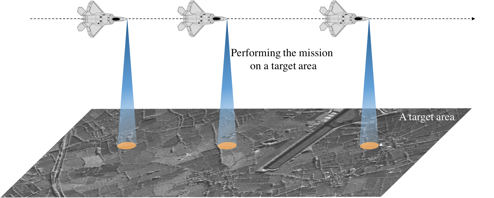
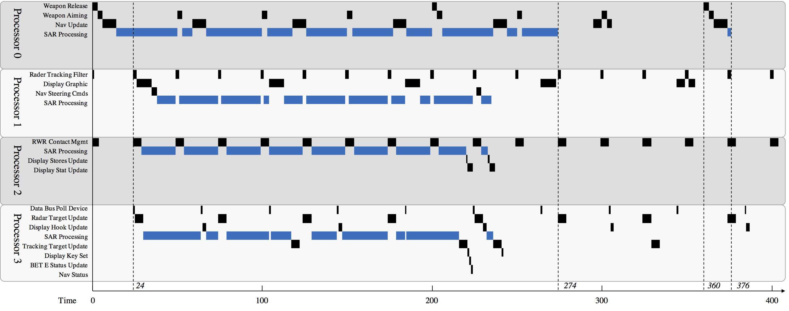

# Thesis
You may find it on the website of [White Rose eTheses Online](http://etheses.whiterose.ac.uk/19750/), or the link for the [PDF file](http://etheses.whiterose.ac.uk/19750/7/Thesis_Haitao_Mei.pdf) that is published on this official website.

In case of the above website under maintenance, you may [Click here to download the PDF version of the thesis: Real-Time Stream Processing in Embedded Systems](Real-Time_Stream_Processing_In_Embedded_Systems_PhD_Thesis_Haitao_Mei.pdf)

# Presentation Slides
You can download the presentation slides (both the PowerPoint version and the PDF version) from [here](Slides/README.md)

# Introduction
The York Real-Time Stream Processing Framework (SPRY), is a real-time stream processing framework, which supports real-time parallel batched data processing. The overall goal of SPRY is to provide a set of simple pipelined APIs so that the data (including batched data and live streaming data) can be GUARANTEED to be processed within the deadline, while the hard real-time tasks in the system remain schedulable.

The batched data source models peridic/sporadic data set processing, or peridic/sporadic sensor or radar data that requries parallel processing due to its heavily computational requirement. The live streaming data models data arriving peridic/sporadically, but the required computation time is relatively very small.

SPRY is currently implemented using Java 8 and the Real-Time Specification For Java ([RTSJ](http://www.rtsj.org)).

### How SPRY Works
SPRY partitions a batched data source into partitions, then processes these partitions using multiple processors (cores).
SPRY uses deferrable servers (one per core) to execute the stream processing task in parallel, and at a proper priority, so that both the stream processing task and the remaining hard real-time activities in the system can still meet their deadlines. Overall, these functionalities are implemented using a real-time ForkJoin thread pool, and a extended version of Java 8 streams [[1]](http://dl.acm.org/citation.cfm?id=2822314).

Additionally, for the live streaming data sources, the dynamically coming data items are grouped into micro batches, and then these batches are processed in parallel. This approach is called real-time micro-batching [[2]](https://link.springer.com/chapter/10.1007/978-3-319-39083-3_4), which releases a batch either the maximum batch size is reached or the timeout expires. With carefully selected batch size and timeout values, each data in a data flow can be processed within the given latency requirement.

However, in both cases, the key is to select deferrable server parameters (period, capacity, priority), to meet all the above requirement. SPRY provides a tools that generates server parameters for each core, according to a given stream processing period and deadline.

##### SPRY architecture, server generation algorithm, response time analysis equations can be found in the thesis(which will be available after two months). 

# Build a Real-Time Stream Processing System
Every activity in a hard real-time system is guaranteed to meet its deadline in any time. With SPRY, a hard real-time stream processing system can be built by the following steps:
##### Step 1. Build the system, i.e., all the tasks in theoritical, and perform schedulability analysis with SPRY utils
##### Step 2. Programming the system using SPRY
##### Step 3. Test, and deploy the system to the hardware etc.
Step 1 and Step 2 can be demostrated by the following two examples:
  - [Case Study of Live Streaming Data Processing with Guaranteed Latency](#case-study-of-live-streaming-data-processing-with-guaranteed-latency) (more complicated),
  - [Real-Time Batched Data Processing](#an-example-of-real-time-batched-data-processing-with-a-hard-real-time-deadline) (more simple).

## Case Study of Live Streaming Data Processing with Guaranteed Latency
This case study considers an aircraft, which is equipped with a synthetic aperture radar (SAR). This aircraft has a mission to generate images of a series of target areas using SAR, whilst its defence systems aim to guarantee its safety during the flight at a maximum speed of 2160 km/h, as shown in the following figure. The minimum distance between any two target areas is 15 meters.

Each image of a target area must be generated within 480 ms after the echoes return. In order to meet the resolution requirement of the imagery of a target area, the worst-case execution time of generating an image from the raw echoes is 40 ms. Specifically, the SAR uses the spotlight imaging mode. In this mode, the radar beam is steered as the aircraft moves, so that it illuminates the same target area over a period of time. All the echoes from a target area are stored along the aircraft flies through the spotlight synthetic aperture, when illuminating the target area. Once the aircraft leaves the synthetic aperture, all the recorded echoes from the target area are summed, and as an input to generate the image of this target area.

The mission control computer in the aircraft is a 4 processor SMP system. The defence system is taken from the Generic Avionics Platform (GAP)[[3]](http://ieeexplore.ieee.org/stamp/stamp.jsp?arnumber=160372), which is similar to existing U.S. Navy / Marine Corps aircraft. The tasks are allocated to different processors using a worst-fit allocation scheme. All the hard real-time tasks in the defence system are described by the following table.

Name | Priority | WCET | Period (Deadline) | Utilisation | Allocated Processor 
--- | --- | --- | --- |--- |--- 
Weapon Release		|98 	|3  	|200  	|1.5		|0
Rader Tracking Filter		|84  |2  	|25  		|8.0		|1
RWR Contact Mgmt 		|72  	|5  	|25  		|20.0	|2
Data Bus Poll Device	|68  	|1  	|40  		|2.5		|3
Weapon Aiming			|64  	|3  	|50  		|6.0		|0
Radar Target Update		|60  	|5  	|50  		|10.0	|3
Nav Update			|56  	|8  	|59  		|13.6	|0
Display Graphic		|40  	|9  	|80  		|11.3	|1
Display Hook Update	|36  	|2  	|80  		|2.5		|3
Tracking Target Update	|32  	|5  	|100  	|5		|3
Nav Steering Cmds		|24  	|3  	|200  	|1.5		|1
Display Stores Update	|20  	|1  	|200 	|0.5		|2
Display Key Set 		|16  	|1  	|200 	|0.5		|3
Display Stat Update		|12  	|3  	|200 	|1.5		|2
BET E Status Update	|8  	|1  	|1000 	|0.1		|3
Nav Status 			|4  	|1  	|1000  	|0.1		|3

### Step 1 Define all the hard real-time tasks, and check schedulability of stream processing task
   
    ArrayList<ArrayList<PeriodicTask>> tsOnAllProcessors = new ArrayList<>();

    /* Processor 0 */
    ArrayList<PeriodicTask> p0 = new ArrayList<>();
    p0.add(new PeriodicTask(98, 200, 3, 200, "Weapon Release"));
    p0.add(new PeriodicTask(64, 50, 3, 50, "Weapon Aiming"));
    p0.add(new PeriodicTask(56, 59, 8, 59, "Nav Update"));
    tsOnAllProcessors.add(p0);

    /* Processor 1 */
    ArrayList<PeriodicTask> p1 = new ArrayList<>();
    p1.add(new PeriodicTask(84, 25, 2, 25, "Rader Tracking Filter"));
    p1.add(new PeriodicTask(40, 80, 9, 80, "Display Graphic"));
    p1.add(new PeriodicTask(24, 200, 3, 200, "Nav Steering Cmds"));
    tsOnAllProcessors.add(p1);

    /* Processor 2 */
    ArrayList<PeriodicTask> p2 = new ArrayList<>();
    p2.add(new PeriodicTask(72, 25, 5, 25, "RWR Contact Mgmt"));
    p2.add(new PeriodicTask(20, 200, 1, 200, "Display Stores Update"));
    p2.add(new PeriodicTask(12, 200, 3, 200, "Display Stat Update"));
    tsOnAllProcessors.add(p2);

    /* Processor 3 */
    ArrayList<PeriodicTask> p3 = new ArrayList<>();
    p3.add(new PeriodicTask(68, 40, 1, 40, "Data Bus Poll Device"));
    p3.add(new PeriodicTask(60, 50, 5, 50, "Radar Target Update"));
    p3.add(new PeriodicTask(36, 80, 2, 80, "Display Hook Update"));
    p3.add(new PeriodicTask(32, 100, 5, 100, "Tracking Target Update"));
    p3.add(new PeriodicTask(16, 200, 1, 200, "Display Key Set"));
    p3.add(new PeriodicTask(8, 1000, 1, 1000, "BET E Status Update"));
    p3.add(new PeriodicTask(4, 1000, 1, 1000, "Nav Status"));
    tsOnAllProcessors.add(p3);
    
    int latency = 480;
    int MIT = 25; /* minimum data arrival interval */
    int MaxBatchSize = 17; /* micro-batch size */
    int C_Item = 40; /* WCET for processing each input */
    int timeout = (MaxBatchSize - 1) * MIT;
    PeriodicTask t_stream = new PeriodicTask(0, timeout, 0, timeout, "");

    boolean schedulable = StreamScheduling.scheduleStreamingStream(tsOnAllProcessors, t_stream, 9, 1, MaxBatchSize * C_Item, 2, MaxBatchSize, 0, MIT, latency);
    System.out.println("All the data item meets the latency constraint:\t" + schedulable);
Note that, the approach to determine maximum batch size, and the timeout values can be find in the thesis(which will be available after two months) chatper 4, section 4.

The output of the Stream Scheduling tools provided by SPRY looks like the following:
     
      ========================Deferrable Servers Generated=======================
      T = 400, C = 314.000, D = 400, Priority = 55  Server[55]
      T = 400, C = 317.000, D = 400, Priority = 23  Server[23]
      T = 200, C = 156.000, D = 200, Priority = 71  Server[71]
      T = 100, C = 78.000, D = 100, Priority = 35  Server[35]
      Total guaranteed computation time for client
        from all processors is 1178.0	in the deadline of 400.0

      ==========Real-Time Stream Processing Task Response Time Analysis===========
      -----------------------Default Pesimism Analysis-----------------------
      Paritition allocations:
      CPU 0:	2, 4, 8, 12, 16, 
      CPU 1:	3, 7, 10, 14, 
      CPU 2:	1, 5, 9, 13, 
      CPU 3:	0, 6, 11, 15, 
      ----------------------------------------------
      Splitting finishes at:	24.00
      In processor 0 parallel processing finishes at:	274.00	 number of partitions allocated: 5
      In processor 1 parallel processing finishes at:	235.00	 number of partitions allocated: 4
      In processor 2 parallel processing finishes at:	233.00	 number of partitions allocated: 4
      In processor 3 parallel processing finishes at:	236.00	 number of partitions allocated: 4
      All of the parallel processings finshes at:	274.00
      The resposne time of the epilogue of the task:	102.00
      -----------------Latency of items --------------------
        Item 0's	Latency =	473.00	✓
        Item 1's	Latency =	449.00	✓
        Item 2's	Latency =	425.00	✓
        Item 3's	Latency =	407.00	✓
        Item 4's	Latency =	418.00	✓
        Item 5's	Latency =	399.00	✓
        Item 6's	Latency =	384.00	✓
        Item 7's	Latency =	360.00	✓
        Item 8's	Latency =	369.00	✓
        Item 9's	Latency =	349.00	✓
        Item 10's	Latency =	329.00	✓
        Item 11's	Latency =	305.00	✓
        Item 12's	Latency =	323.00	✓
        Item 13's	Latency =	308.00	✓
        Item 14's	Latency =	285.00	✓
        Item 15's	Latency =	261.00	✓
        Item 16's	Latency =	274.00	✓
      The stream processing task's response time:	376.00	✓
      All the data item meets the latency constraint:	true
The deferrable servers are first generated by this tools. Then, in the worst-case, the latency of each data item is calculated, also the response time of the processing of each micro batch. The above values indicates this system is schedulable.

The code is purely written in Java, and located in src/demo/StreamingTimeAnalysis/CaseStudy.java

The execution of all the tasks are illustrated by the following figure.

### Step 2. Programming the system using SPRY
The hard real-time tasks is implemented using real-time threads, the implementation of these tasks are out of the scope of this documents. This demo describes how to define a real-time stream processing instance with above server parameters. The following code fragement first create DeferrableServers according to the parameters determined in the previouse step, the create a SPRY BatchedStream instance, with a receiver that receives the input items, a data allocation policy, and the processing pipeline. Then BatchedStream automatically perform the micro-batching, and data splitting, and processing in real-time.        
        
        /* create deferrable servers using the generated parameters */
        DeferrableServer[] servers = ...;
        /* Allocates processor 0, 1, 2, 3 */
        BitSet affinities = new BitSet();
        affinities.set(0);
        affinities.set(1);
        affinities.set(2);
        affinities.set(3);
	
        DataAllocationPolicy DAP = new CustomisedDataAllocationPolicy();
        DAP.addPairs(0, 2, 4, 8, 12, 16);
        DAP.addPairs(1, 3, 7, 10, 14);
        DAP.addPairs(2, 1, 5, 9, 13);
        DAP.addPairs(3, 0, 6, 11, 15);
	
        BatchedStream<Integer> streaming = new BatchedStream<Integer>(
                receiver, /* which receives radar raw inputs */
                timeout,  /* the timeout value for micro-batching */
                11,       /* priority */
                p -> p.
                    /* image generation pipeline */
                    .forEachDeferred(/* update display*/),
                affinities, DAP, 0, servers
        );
        streaming.start(startTime);
The source code of a emulation of this case study is located in src/demo/RealtimeStreaming/CaseStudyEvaluation.java. Compile it using [Jamaica](https://www.aicas.com/cms/en/JamaicaVM), which is an implementation of RTSJ, and run the code using following commands on a Linux bash:
        
        sudo taskset -c 0,1,2,3,4,5 jamaicavmm_slim_bin -Xbootclasspath/p:. -Dsun.boot.library.path=. demo.RealtimeStreaming.CaseStudyEvaluation

## An Example of Real-Time Batched Data Processing with a Hard Real-Time Deadline

Consider the real-time stream processing task is released on processor 0, with a period of 800 time units and a deadline of 780 time units after each of its releases. It can utilise all the processors for the parallel data processing. The worst-case execution time (WCET) for the sequential code before the data processing is 18 time units, the splitting requires 1 time unit, and the sequential code after the parallel data processing is 11 time units. The data has 12 partitions, and the worst-case computation time required for processing each partition is 30 time units. Both the prologue and epilogue execute on processor 0.

The system has 3 processors, and also hosts 4 hard real-time task:

Name | Priority | WCET | Period | Deadline | Allocated Processor 
--- | --- | --- | --- |--- |--- 
Task1 |11 |10  |20  |20  |0
Task2 |9  |10  |40  |40  |1
Task3 |5  |20  |100 |50  |2
Task4 |3  |40 |100  |100  |2

## Step 1. Build the conceptual system, and check schedulability of stream processing task

		ArrayList<ArrayList<PeriodicTask>> tsOnAllProcessors = new ArrayList<>();

		ArrayList<PeriodicTask> p0 = new ArrayList<>();
		p0.add(new PeriodicTask(11, 20, 10, 20, "t1"));
		tsOnAllProcessors.add(p0);

		ArrayList<PeriodicTask> p1 = new ArrayList<>();
		p1.add(new PeriodicTask(9, 40, 10, 40, "t2"));
		tsOnAllProcessors.add(p1);

		ArrayList<PeriodicTask> p2 = new ArrayList<>();
		p2.add(new PeriodicTask(5, 100, 20, 50, "t3"));
		p2.add(new PeriodicTask(3, 100, 40, 100, "t4"));
		tsOnAllProcessors.add(p2);
        
		PeriodicTask t_stream = new PeriodicTask(0, 800, 0, 780, ""); /* Period 800, deadline 700 */
		StreamScheduling.scheduleStaticStream(tsOnAllProcessors, t_stream, 18, 1, 360, 11, 12, 0);

The output generated by SPRY server generation and schedulabity analysis tools is:
        
        ========================Deferrable Servers Generated=======================
        T = 800, C = 400.000, D = 800, Priority = 10  Server[10]
        T = 800, C = 600.000, D = 800, Priority = 8  Server[8]
        T = 50, C = 20.000, D = 50, Priority = 6  Server[6]
        Total guaranteed computation time for client
            from all processors is 1199.0	in the deadline of 780.0

        ==========Real-Time Stream Processing Task Response Time Analysis===========
        -----------------------Default Pesimism Analysis-----------------------
        Paritition allocations:
        CPU 0:	1, 4, 8, 11, 
        CPU 1:	0, 3, 5, 7, 9, 
        CPU 2:	2, 6, 10, 
        ----------------------------------------------
        Splitting finishes at:	39.00
        In processor 0 parallel processing finishes at:	279.00	 number of partitions allocated: 4
        In processor 1 parallel processing finishes at:	239.00	 number of partitions allocated: 5
        In processor 2 parallel processing finishes at:	249.00	 number of partitions allocated: 3
        All of the parallel processings finshes at:	279.00
        The resposne time of the epilogue of the task:	431.00
        The stream processing task's response time:	710.00	✓

The deferrable server are generated for each processor, then the response time of the stream processing with the given batched data source is analysed step by step.

The code is purely written in Java, it located in src/demo/StreamingTimeAnalysis/batchedDataStreamProcessingExample.java.

## Step 2. Programming a Batched Data Stream Processing Task Using SPRY
With the help of SPRY Engine, the data is automatically partitioned, allocated to differetn processors for processing. The processing is executed under deferrable servers, at the corresponding priority. The code fragement is given below:
		
		/* Deferrable servers */
		DeferrableServer[] servers = ...;
		/* Data Allocation Policy */
		DataAllocationPolicy DAP = ...;
		/* SPRY Engine */
		SPRYEngine<Integer> spry = new SPRYEngine<>(priority,
			p -> p.map(...).forEachDeferred(...), /* processing pipeline */
			Affinity.getAvailableProcessors(), /* use all cores */
			DAP, servers);
		/* detecting if there are two releases issued within its period, i.e., 800 ms */
		spry.setMITViolateHandler(new RelativeTime(800,0), new AsyncEventHandler(){
			@Override
			public void handleAsyncEvent() {
				super.handleAsyncEvent();
				System.out.println("MIT Violation");
			}
		});
		/* detecting if there is any deadline (780 ms) miss */
		spry.setDeadlineMissHandler(new RelativeTime(780,0), new AsyncEventHandler(){
			@Override
			public void handleAsyncEvent() {
				super.handleAsyncEvent();
				System.out.println("Deadline Miss");
			}
		});
		
		spry.processBatch(data);
The source code of a demo of using SPRY Engine is located in src/demo/RTStreamForBatchedDataSources/SPRYEngineDemo.java Compile it using [Jamaica](https://www.aicas.com/cms/en/JamaicaVM), which is an implementation of RTSJ, and run the code using following commands on a Linux bash:
        
        sudo taskset -c 0,1,2 jamaicavmm_slim_bin -Xbootclasspath/p:. -Dsun.boot.library.path=. demo.RTStreamForBatchedDataSources.SPRYEngineDemo
